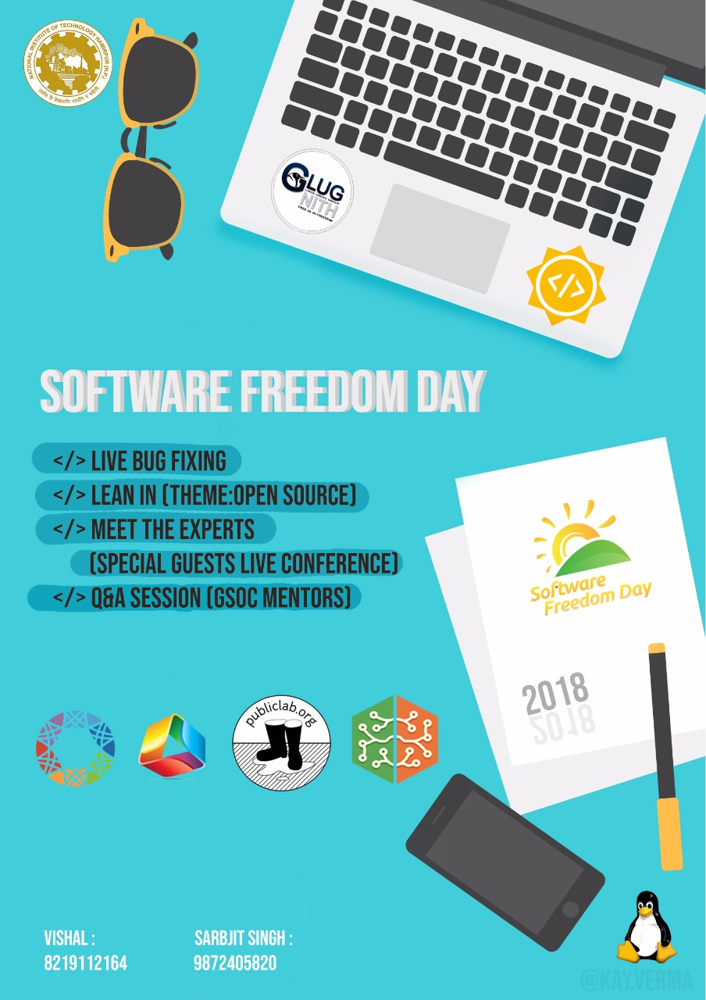

# SHUT THE BUG UP

This Repository is made for SFD-2018 event **SHUT THE BUG UP**. This event is conducted by GLUG-NITH. The main purpose of this event is to promote Open-Source and Free-Software among students.

Branch | Linux / macOS | Windows
:----: | :-----------: | :-----:
Master |  | 

## Software Freedom Day @ 2k18

### Contact / Social Media

*Get the latest News about Web Development, Open Source, Tooling, Server & Security*

### Development by

Developer / Author: [Srb Cheema](https://github.com/srbcheema1/)
